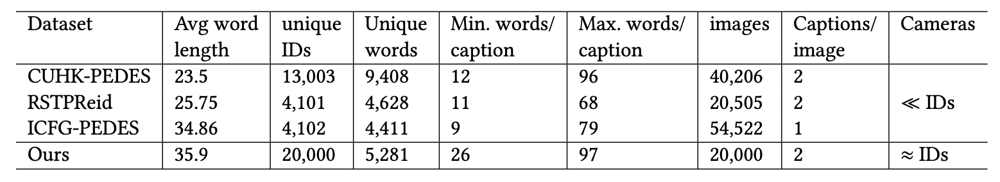
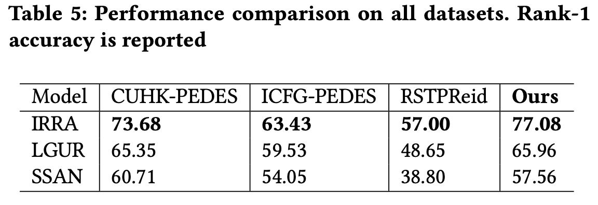
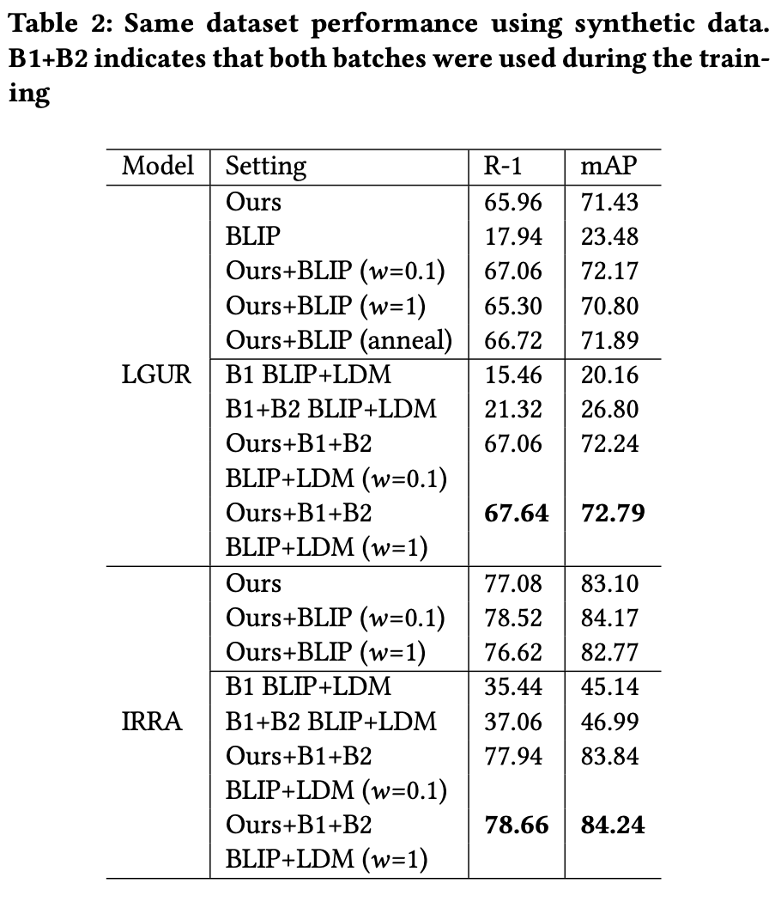
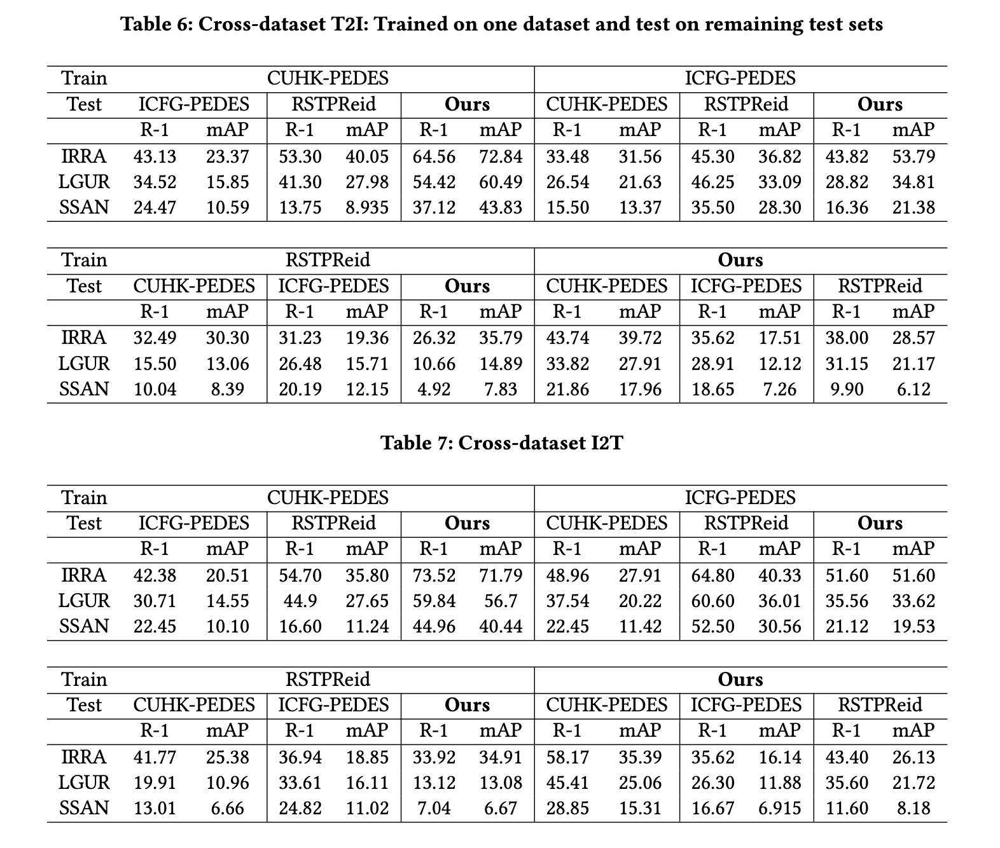

# Dense captioning for Text-Image ReID

This repository contains the model testing framework used for benchmarking the new IIITD Person Re-Identification dataset across different SOTA person re-id models. Cross Dataset testing framework has been built-in for all these models. We also provide pre-processing scripts required for the dataset in their respective models directory.

The repository will be update later with links and codes for the IIITD dataset and its augmented synthetic extension. 

IIITD-20K dataset comprises of 20,000 identities captured in the wild and provides a rich dataset for Text-to-Image ReID. With a minimum of 26 words for a description, each image is densely captioned. We further provide synthetically generated images and fine-grained captions using Stable-diffusion and BLIP models trained on the orignal dataset. 


## IIITD-20K Dataset

1. Download the dataset from [link](https://drive.google.com/file/d/1oG0a4WQfkEeL_NKajtMQvY4yFnZ5jDJ8/view)
2. Unzip the zip file to IIIT-20K-Dataset directory 
3. Run the required formatter python script from IIITD-20K-Dataset (format_ICFG.py/format_CUHK.py/format_RSTPs.py)

To download:
```bash
git clone https://github.com/vibsterD/Dense-Captioning-for-Text-Image-ReID.git
cd Dense-Captioning-for-Text-Image-ReID/
pip install gdown 
gdown <dataset_gdrive_link> --fuzzy
unzip IIITD-20K.zip -d ./IIITD-20K-Dataset
cd IIITD-20K-Dataset/
python format_<type>.py
```

### Dataset Meta 



### Dataset Results

1. Same Dataset Setting 


2. Cross Dataset Setting



### Model Testing Frameworks 
Please refer to the basic instructions from the respective repositories. But use the edited the code we provide in this repository for reproduction.

1. [IRRA](https://github.com/anosorae/irra) 
2. [LGUR](https://github.com/ZhiyinShao-H/LGUR)
3. [SSAN](https://github.com/zifyloo/SSAN)

Preprocessing for all the models except SSAN is standard for running the cross-dataset evaluations. 

SSAN requires further dataset preprocessing when doing cross-dataset testing since the underlying the vocabulary of the trained model is different from the vocabulary of the dataset it is being tested on. 

Currently all logs are provided as is in the checkpoints or the logs folder of the respcetive models directory. Drive link with .pth files will be updated later. 

We thank and acknowledge the authors of [LGUR](https://github.com/ZhiyinShao-H/LGUR), [IRRA](https://github.com/anosorae/irra), and [SSAN](https://github.com/zifyloo/SSAN) for realeasing their codes on which we were able to benchmark the new proposed dataset. 
